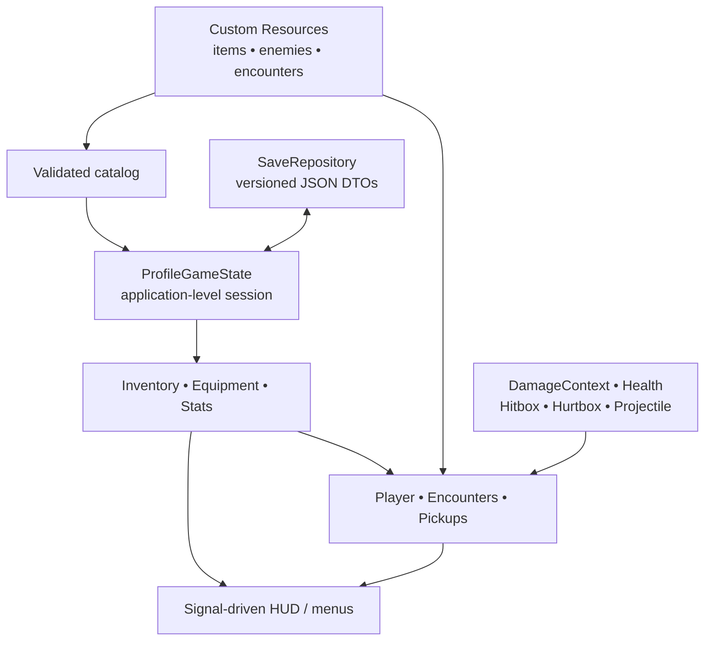

# Architecture

## Dependency direction

Dependencies point from presentation and gameplay toward stable data/domain contracts. The inventory has no UI reference. Equipment coordinates inventory and stat sources, but neither model knows about nodes. Persistence accepts and returns dictionaries shaped as DTOs; it does not serialize Nodes, PackedScenes, or object references.

## Ownership and lifecycle

| Owner | Owned lifetime | Responsibility |
| --- | --- | --- |
| `GameRoot` | Application scene | World shell, run transitions, puzzle orchestration, camera, HUD binding |
| `GameState` autoload | Process | Profile, catalog, inventory/equipment/stats, repository orchestration |
| `EncounterRoom` | Current main scene | Trigger, spawned enemies, alive set, entry/exit locks, session completion |
| Actor | Actor node | Controller/behavior plus composed health and hurtbox |
| Attack producer | Attack duration | Damage context, hitbox/projectile, hit set, visual telegraph |
| UI | Main scene | Read-only projection and commands into domain APIs |

Spawned enemies are tracked by instance ID and connected via defeat signals. No persistent object contains a Node reference. Runtime damage has an optional `WeakRef` source for presentation/authority checks and a stable source actor ID for future transport.

## Key boundaries

### Combat

`DamageContext` carries amount, damage type, attack category, source team, stable source actor ID, optional weak runtime source, knockback, and hit position. `Hitbox` only discovers `Hurtbox` areas and forwards the context. `Hurtbox` filters same-team damage and delegates to `HealthComponent`. Health owns invulnerability, armor reduction, clamping, death, and related signals.

This supports new weapons, status processing, authority validation, or replicated payloads without rewriting actor controllers. Multiplayer transport and reconciliation are not implemented.

### Inventory and equipment

`ItemDefinition` is static Resource data. `ItemInstance` is runtime/serialized state with a unique ID, stable definition ID, quantity, durability, upgrade level, rolled modifiers, and metadata. `InventoryModel` validates definitions and capacity; `EquipmentModel` enforces slot compatibility and applies modifiers by source ID into `StatBlock`.

Replacement is transactional at the model scale: the candidate is removed, the old item returns to inventory, and failure restores the candidate. Loading validates obsolete IDs, stack limits, slots, and structural shape before applying state.

### Persistence

`ProfileGameState` constructs a DTO and delegates to `SaveRepository`. The repository normalizes defaults, validates shape and version, migrates v1, writes a temporary file, rotates the prior primary to a backup, and renames the temporary file into place. Loading can recover from a valid backup. The repository can be replaced without changing domain models.

### Encounters

`EncounterDefinition` supplies enemy IDs, positions, objective text, and stable room/encounter IDs. `EncounterRoom` is reusable: entry triggers start once, doors lock, enemies spawn from the catalog, death signals update the alive set, and doors unlock on completion. Run reset clears spawned nodes and session completion.

## Generalized versus slice-specific

Generalized intentionally:

- Stable content IDs and validated Resource catalogs.
- Item definition/instance split, stacking/capacity, equipment slots, stat modifier sources.
- Damage payloads, team filtering, reusable hit/hurt/health components.
- Encounter definitions and room objective lifecycle.
- Versioned DTO persistence and repository replacement boundary.

Limited intentionally:

- A single linear world builder and one hard-coded relay puzzle sequence.
- Melee, ranged, and boss modes inside one actor state boundary.
- Local profile persistence only.
- Direct open-room steering and primitive-only presentation.
